# distributed-system-design-pattern

## Overview
Collect modern distributed system design patterns.

## Categories
- **Architecture Pattern**
   - Anti-Corruption Layer (ACL)
   - Backends for Frontends (BFF)
- **Cache Pattern**
   - Cache-Aside
   - Cache-As-SOR
      - Read-Through
      - Write-Through
      - Write-Behind
      - Refresh-Ahead
- **Data Management Patterns**
   - Command and Query Responsibility Segregation (CQRS)
   - Event Sourcing
   - Saga
   - API Composition
   - Database Per Service
   - Shared Database
- **Messaging Patterns**
   - Claim Check
- **Container Patterns**
   - Single-node, multi-container patterns
      - Sidecar
      - Ambassador
      - Adapter
   - Multi-node patterns
      - Leader Election
      - Work Queue
      - Scatter/Gather
- **Resiliency Patterns**
   - Circuit Breaker
   - Fallback
   - Bulkhead
   - Retry
- **Configuration Patterns**
   - External Configuration Store
   - Runtime Reconfiguration
- **Security Patterns**
   - Valet Key

## Brief Introduction
### Cache Patterns
#### Cache Pattern Categories

| Category Name | Diagram | Description | Patterns |
|----|----|----|----|
| *Cache-Aside* | 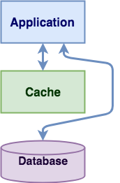 | Application interacts with both cache and database (No interaction between cache and database). |  |
| *Cache-As-SOR* | 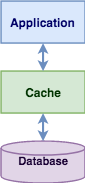 | Application only interacts with cache. | <ul><li>Read-Through<li>Write-Through<li>Write-Behind<li>Refresh-Ahead</ul> |

#### Cache-As-SOR Patterns

| Pattern Name | Diagram | Description | 
|----|----|----|
| *Read-Through* | 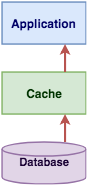 | If requested data is not in cache, cache will load the data from database and let application read **synchronously**. |
| *Write-Through* |  | After application writes data to cache, cache **synchronously** write the same data to database. |
| *Write-Behind* | 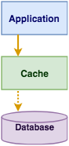 | After application writes data to cache, cache **asynchronously** write the same data to database (When satisfy a certain criteria). |
| *Refresh-Ahead* | 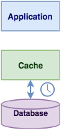 | Cache automatically and **asynchronously** reloads (refreshs) any recently accessed cache entry from database before its expiration. |

### Container Patterns

| Pattern Name | Diagram | Description |
|----|-------|----|
| *Ambassador* | 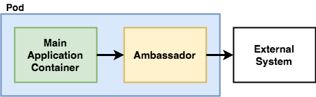 | <ul><li>Place an ambassador container between the main application container and the external system for simplifying the view of the external system.</ul> |
| *Adapter* | 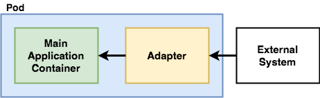 | <ul><li>Place an adapter container between the main application container and the external system for standardizing the view of the internal application.</ul> |
| *Sidecar* | 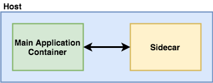 | <ul><li>Place an independent sidecar container next to the main application container for providing supportive works to the main application container.</ul> |
| *Leader Election* | 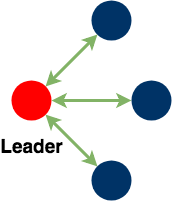 | <ul><li>Elect one instance as the leader for coordinating and monitoring the other instances.</ul> |
| *Work Queue* | 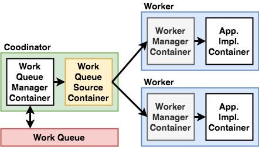 | <ul><li>Group a work queue manager container and a work queue source container as a coordinator for managing the work queue and dispatch work items to workers.<li>Each worker consists of a worker manager container (for integrating with the generic work queue framework) and an application implementation container (for application-specific logic).</ul> |
| *Scatter/Gather* | 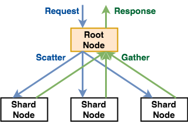 | <ul><li>The root node scatters out the original request to a group of servers to perform a set of tasks in parallel.<li>The root node gathers the partial data from each server and return a single response to the original request.</ul>

### Resiliency Patterns

| Pattern Name | Diagram | Description |
| ---- | ------ | ---- |
| *Circuit Breaker* |  | Prevent an application from performing an operation that is likely to fail based on a certain criteria. |
| *Bulkhead* |  | Isolate the misbehaving service and avoid to take down the entire application by exhausting all the resources. |
| *Fallback* |  | When a service call fails, execute the alternative action. |
| *Retry* |  | Retry a failed operation. |

### Architecture Patterns
| Pattern Name | Diagram | Description |
| ---- | ------ | ---- |
| *Anti-Corruption Layer* (ACL) | 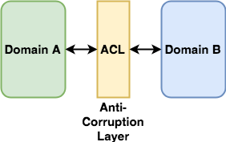 | Place an adapter layer between 2 domain models and translate communications between them. | 
| *Backends For Frontends* (BFF) | 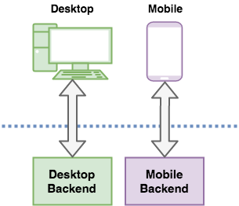 | Separate backend services for different frontend applications or interfaces. |

### Messaging Patterns
| Pattern Name | Diagram | Description |
| ---- | ------ | ---- |
| *Claim Check* | 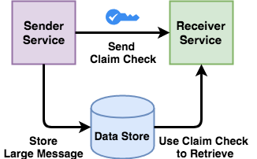 | When sending a large message from one service to another, store the large message into a data store, only send the reference as the claim check to the receiver service for retrieving the large message from the data store. |
