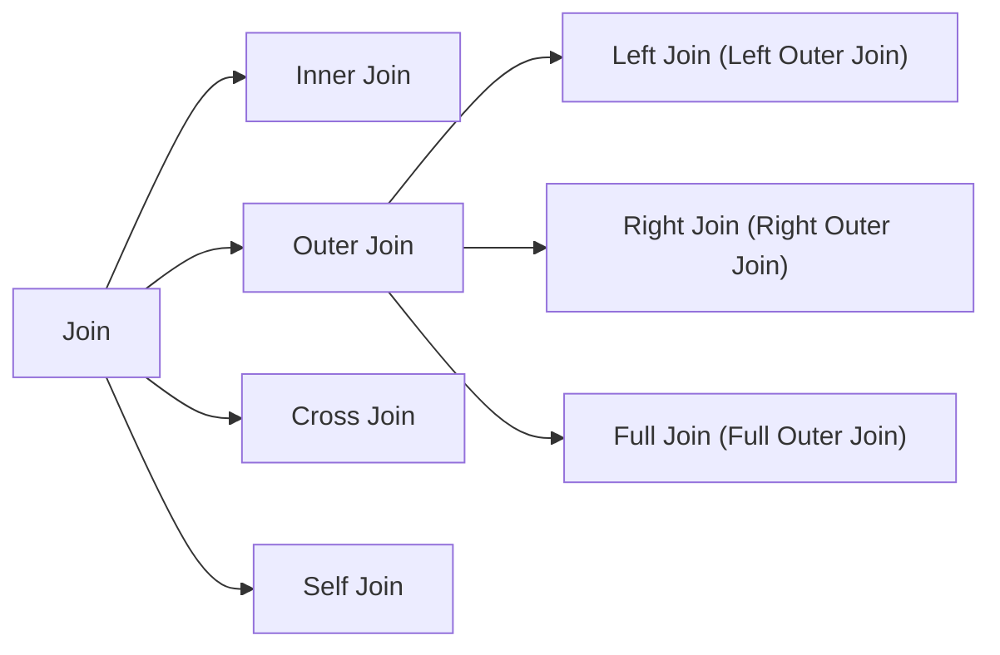

# Database SQL - Join

## Overview



## Inner Join
- Venn diagram

  

- SQL example
  ```
  SELECT * FROM TableA a
  INNER JOIN TableB b
  ON a.key = b.key
  ```
- Result example

  

## Outer Join
