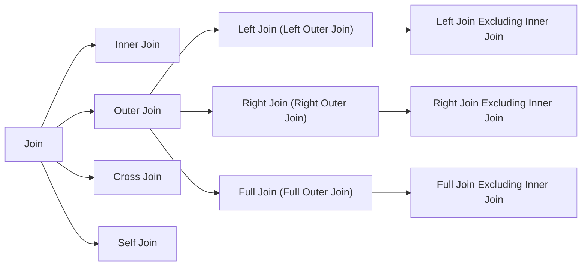

# Database SQL - Join

## Overview



## Inner Join
- **Venn diagram**

  

- **SQL example**
  ```sql
  SELECT * FROM TableA a
  INNER JOIN TableB b
  ON a.key = b.key;
  ```
- **Result example**

  

## Outer Join
### Left Join
- **Venn diagram**

  

- **SQL example**
  ```sql
  SELECT * FROM TableA a
  LEFT JOIN TableB b
  ON a.key = b.key;
  ```
- **Result example**

  

- **Notes**
   - All the records from the left table will be included into the result, even if there is no matching on the right table.

### Left Join Excluding Inner Join
- **Venn diagram**

  
  
- **SQL example**
  ```sql
  SELECT * FROM TableA a
  LEFT JOIN TableB b
  ON a.key = b.key
  WHERE b.key IS NULL;
  ```
- **Result example**

  

### Right Join
- **Venn diagram**

  
  
- **SQL example**
  ```sql
  SELECT * FROM TableA a
  RIGHT JOIN TableB b
  ON a.key = b.key;
  ```
- **Result example**

  

### Right Join Excluding Inner Join
- **Venn diagram**

  
  
- **SQL example**
  ```sql
  SELECT * FROM TableA a
  RIGHT JOIN TableB b
  ON a.key = b.key
  WHERE a.key IS NULL;
  ```
- **Result example**

  

### Full Join
- **Venn diagram**

  
  
- **SQL example**
  ```sql
  SELECT * FROM TableA a
  FULL OUTER JOIN TableB b
  ON a.key = b.key;
  ```
- **Result example**

  

### Full Join Excluding Inner Join
- **Venn diagram**
  
  

- **SQL example**
  ```sql
  SELECT * FROM TableA a
  FULL OUTER JOIN TableB b
  ON a.key = b.key
  WHERE a.key IS NULL or b.key IS NULL;
  ```
- **Result example**

  

  
## Cross Join
- **SQL example**
  ```sql
  SELECT * FROM TableA a
  CROSS JOIN TableB b;
  ```
- **Result example**

  

## Self Join
- **SQL example**
  ```sql
  SELECT * FROM TableA a1
  FULL OUTER JOIN TableA a2
  ON a1.column1 = a2.column2;
  ```
- **Result example**
   - Original table
     | ID | Name | ManagerID |
     |----|----|----|
     | 456 | Robert | |
     | 383 | Cook | 222 |
     | 777 | Daniel | 222 |
     | 123 | Smith | 456 |
     | 222 | William | 456 |
   - Result
     | ID | Name | ManagerID | Manager |
     |----|----|----|----|
     | 456 | Robert | | |
     | 383 | Cook | 222 | William |
     | 777 | Daniel | 222 | William |
     | 123 | Smith | 456 | Robert |
     | 222 | William | 456 | Robert |
