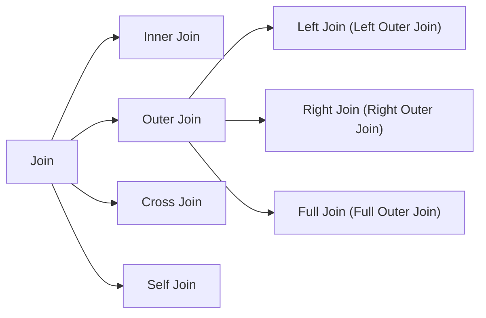

# Database SQL - Join

## Overview

```mermaid
graph LR;
  A["Join"] --> B1["Inner Join"];
  A --> B2["Outer Join"];
  A --> B3["Cross Join"];
  A --> B4["Self Join"];
  B2 --> C1["Left Join (Left Outer Join)"];
  B2 --> C2["Right Join (Right Outer Join)"];
  B2 --> C3["Full Join (Full Outer Join)"];
```

## Inner Join
```mermaid
venn
  A[Set A] 50;
  B[Set B] 50;
  A_B[Intersection A and B] 20;
```

## Outer Join
