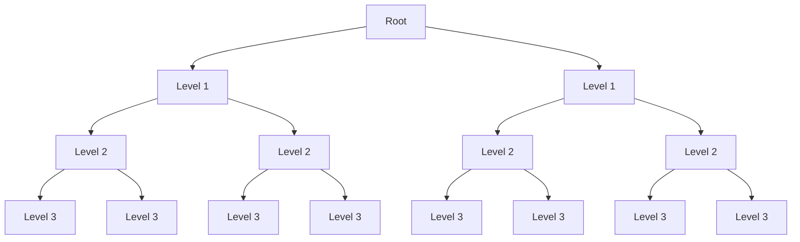

# Database SQL - Join

## Overview

```mermaid
graph TD;
  A[Root] --> B[Level 1];
  A --> C[Level 1];
  B --> D[Level 2];
  B --> E[Level 2];
  C --> F[Level 2];
  C --> G[Level 2];
  D --> H[Level 3];
  D --> I[Level 3];
  E --> J[Level 3];
  E --> K[Level 3];
  F --> L[Level 3];
  F --> M[Level 3];
  G --> N[Level 3];
  G --> O[Level 3];
```

## Inner Join

## Outer Join
