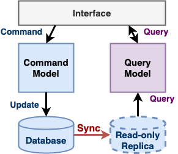
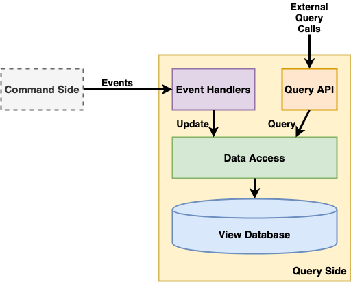

# Command Query Responsibility Segregation (CQRS)

- [**Motivation**](#motivation)
- [**Solution**](#solution)
   - [Concepts](#concepts)
   - [Implementation](#implementation)
      - [Command Side](#command-side)
      - [Query Side](#query-side)
- [**Pros & Cons**](#pros--cons)
   - [Pros](#pros)
   - [Cons](#cons)
- [**Consideration**](#consideration)
- [**When To Use**](#when-to-use)
- [**References**](#references)

## Motivation
- Read and write workloads are often asymmetrical, with very different performance and scale requirements.

## Solution
### Concepts
- Separate a service into two parts: the command side and the query side.
- The command side modules and data model implement create, update, and delete operations (CUD).
- The query-side modules and data model implement queries (R).
- The query side keeps its data model synchronized with the command-side data model.

### Implementation
#### Database

- Command-side database and query-side database can use one database or separated databases.
   - One database.
      - 
   - Separated database.
      - 
- If separate command-side and query-side databases are used:
   - They can use different types of database. For example, one database might be SQL, another one might be No-SQL.
   - They can use different data schema. For example, the schema of query-side database can be optimized for queries.
   - They can be scaled differently.
   
#### Synchronization
- If separate command-side and query-side databases are used, they must be kept in sync.
- There are several options for synchronization:
   - **By event**: The query-side subscribes to the events published by the command-side.
      - 
   - **By read-only replica**: The query-side uses the read-only replica of the command-side database.
      - 
   
#### Command Side
#### Query Side

- Participants and their responsibilities
   - View database
      - Persists multiple views of data.
   - Data access
      - Implements the database access logic.
      - Implements the update operations invoked by the event handlers and the query operations invoked by the query API.
      - Consists of a data access object (DAO) and its helper classes.
   - Event handlers
      - Subscribes to events published by the command side.
      - Updates or deletes data in the view database using primary keys or foreign keys.
   - Query API
      - Implements the query API.

## Pros & Cons
### Pros
- Improve the efficiency of query operations. 
- Simplify the query model and the command model.
- Supports multiple denormalized views of data.

### Cons
- Increased complexity.
- Dealing with the replication lag  between the command-side and the query-side.

## Consideration
| Topic | Consideration | Possible Solution Options |
|----|-----|-----|
| Concurrency | Multiple concurrent updates to the same database record. | <li>Consider to use pessimistic or optimistic locking. |
| Messaging | If the query-side keep synchronized with the command-side by events, the event handler in the query-side must be able to handle duplicated events and event message failures. | <li>Consider to record the IDs of events that it has processed in the query-side database. |
| Eventual consistency | A client that updates the command side and then immediately executes a query might not see its own update. | <li>Consider to use this approach to let the client detect an inconsistency: A command-side operation returns a token containing the ID of the published event to the client. The client then passes the token to a query operation, which returns an error if the view hasn’t been updated by that event. |

## When To Use

## References
- Book: [Chris R.(2018). Chapter 7 Implementing queries in a microservice architecture, *Microservices Patterns* (pp. 220-252). Manning Publications](https://www.manning.com/books/microservices-patterns)
- Web Article: [Pattern: Command Query Responsibility Segregation (CQRS) | https://microservices.io/patterns/data/cqrs.html](https://microservices.io/patterns/data/cqrs.html)
