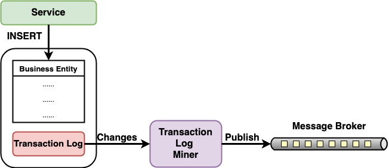

# Transaction Log Tailing

- [**Motivation**](#motivation)
- [**Solution**](#solution)
   - [Concepts](#concepts)
   - [Implementation](#implementation)
- [**Pros & Cons**](#pros--cons)
   - [Pros](#pros)
   - [Cons](#cons)
- [**Consideration**](#consideration)
- [**When To Use**](#when-to-use)
- [**References**](#references)

## Motivation
- How to update the database and publish a message (event) atomically (either all success, or all fail).
- Cannot use distributed transaction pattens to solve this problem.
   - Many modern message brokers don’t support distributed transactions.

## Solution
### Concepts
- 
- Publish messages by tailing the database’s transaction log.
- A transaction log miner reads the transaction log and publish each change as a message to the message broker.

### Implementation
- Requires database specific solutions.
- It can be difficult to reverse engineer the high‑level business events from the low‑level updates recorded in the transaction log.

## Pros & Cons
### Pros
- The atomicity of updating the database and publishing a message (event) is guaranteed.

### Cons
- Requires database specific solutions.

## Consideration
| Topic | Consideration | Possible Solution Options |
|----|-----|-----|

## When To Use

## References
- Book: [Chris R.(2018). Chapter 3. Interprocess communication in a microservice architecture, *Microservices Patterns* (pp. 65-109). Manning Publications](https://www.manning.com/books/microservices-patterns)
- Web Article: [Pattern: Transaction log tailing | https://microservices.io/patterns/data/transaction-log-tailing.html](https://microservices.io/patterns/data/transaction-log-tailing.html)
- Web Article: [Event-Driven Data Management for Microservices | https://www.nginx.com/blog/event-driven-data-management-microservices/](https://www.nginx.com/blog/event-driven-data-management-microservices/)
