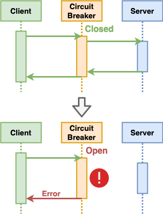
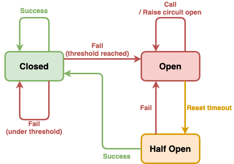

# Circuit Breaker

- [**Motivation**](#motivation)
- [**Solution**](#solution)
   - [Concepts](#concepts)
   - [Implementation](#implementation)
      - [Basic mechanism](#basic-mechanism)
      - [States](#states)
      - [More Sophisticated Approaches](#more-sophisticated-approaches)
- [**Pros & Cons**](#pros--cons)
   - [Pros](#pros)
   - [Cons](#cons)
- [**Consideration**](#consideration)
- [**When To Use**](#when-to-use)
- [**References**](#references)

## Motivation

## Solution
### Concepts
- Detects failures and prevents a failure from constantly recurring.

### Implementation
#### Basic mechanism

- Adds circuit breaker in the middle of a client and service.
- Circuit breaker monitors failures by tracking the number of failures.
- Once the error rate exceeds some threshold, the circuit breaker will trip so that all further calls fail immediately.

#### States

- Circuit breaker retains a state over a series of calls, there are 3 common value:
   - **Closed**
      - This is the default value. Circuit breaker doesn't intervene calls except counting the number of failures.
   - **Open** 
      - Once the error rate exceeds some threshold, the circuit breaker's state will be changed to this value and all further calls will be failed immediately. 
      - Timeout timer will be started for changing the state from "Open" to "Half open" when timeout.
      - The calls from the client fail immediately.
   - **Half open** 
      - Circuit breaker accepts a limited number of calls: 
         - If all those calls are successful, the circuit breaker will change the state to "Closed" and will all the calls as normal. 
         - If any call fails, the circuit breaker will reverts back the state to "Open" and block all the calls.

#### More Sophisticated Approaches
- General
  - Log all failed calls to enable an administrator to monitor the health of the operation.
  - Provide a manual option for an administrator to close or open a circuit breaker.
- In the Closed state
  - Handle different types of errors more specifically.
  - Check frequency of errors rather than number of errors.
  - Have different thresholds for different types of errors.
- In the Open state
  - Rather than using a timer to determine when to switch to the Half-Open state, a circuit breaker can instead periodically ping the service to determine whether it's become available again.
  - Rather than simply failing quickly, a circuit breaker could also record the details of each call to a journal and arrange for these calls to be replayed when the service becomes available.

## Pros & Cons
### Pros
- Prevents a failure from constantly recurring.
   - Reduce resources tied up in operations which are likely to fail.
   - Avoid waiting on timeouts for the client.
   - Avoid putting load on a struggling server.

### Cons
- Negatively affects on performance.

## Consideration
| Topic | Consideration | Possible Solution Options |
|----|-----|-----|

## When To Use

## References
- Web Article: [Circuit breaker design pattern | https://en.wikipedia.org/wiki/Circuit_breaker_design_pattern](https://en.wikipedia.org/wiki/Circuit_breaker_design_pattern)
- Web Article: [断路器设计模式 | https://zh.wikipedia.org/wiki/%E6%96%B7%E8%B7%AF%E5%99%A8%E8%A8%AD%E8%A8%88%E6%A8%A1%E5%BC%8F](https://zh.wikipedia.org/wiki/%E6%96%B7%E8%B7%AF%E5%99%A8%E8%A8%AD%E8%A8%88%E6%A8%A1%E5%BC%8F)
- Web Article: [CircuitBreaker | https://martinfowler.com/bliki/CircuitBreaker.html](https://martinfowler.com/bliki/CircuitBreaker.html)
