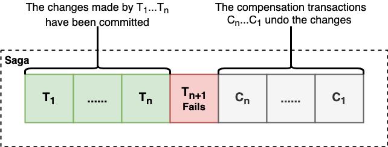

# Saga

- [**Motivation**](#motivation)
- [**Solution**](#solution)
   - [Concepts](#concepts)
   - [Implementation](#implementation)
- [**Pros & Cons**](#pros--cons)
   - [Pros](#pros)
   - [Cons](#cons)
- [**Consideration**](#consideration)
- [**When To Use**](#when-to-use)
- [**References**](#references)

## Motivation

## Solution
### Concepts

- A sequence of local transactions.
   - Each local transaction updates data within a single service.
   - A service publishes an asynchronous message when a local transaction completes. The message triggers the local transaction in the next service.
- Use compensating transactions to rollback changes
   - Each local transaction has a compensating transaction to undo the change.
   - If one transaction fails, the saga needs to execute the compensating transaction of preceding transactions in reverse order.

### Implementation
#### Types of Saga
- **Choreography**
   - *Concepts*
      - Saga participants coordinate a saga operation by themselve.
      - A saga participant sends a message to the next saga participant triggering its local transaction.
   - *Pros*
      - Easy to implement.
      - Avoid the single point of failure of the saga orchestrator in the orchestration saga.
   - *Cons*
      - Risk of cyclic dependencies.
      - More difficult to understand (There is no a single place in the code that defines the saga).
   
- **Orchestration**
   - *Concepts*
      - A saga orchestrator coordinates a saga operation with saga participants.
      - A saga orchestrator sends messages to saga participants telling them which transactions to perform.
   - *Pros*
      - Easy to understand (The code in orchestrator defines the saga).
      - Avoid the risk of cyclic dependencies.
      - Improves separation of the saga coordination logic (in the saga orchestrator) and the business logic (in saga participants).
   - *Cons*
      - Saga orchestrator has risk to become a single point of failure.
      - The risk of centralizing too much business logic in the orchestrator.

## Pros & Cons
### Pros
- Maintains the data consistency of an application across multiple services.

### Cons
- Increases the complexity of an application.
- Lack of isolation between transactions.

## Consideration
| Topic | Consideration | Possible Solution Options |
|----|-----|-----|

## When To Use

## References
- Book: [Chris R.(2018). Chapter 4. Managing transactions with sagas, *Microservices Patterns* (pp. 110-145). Manning Publications](https://www.manning.com/books/microservices-patterns)
- Web Article: [Pattern: Saga | https://microservices.io/patterns/data/saga.html](https://microservices.io/patterns/data/saga.html)
