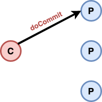
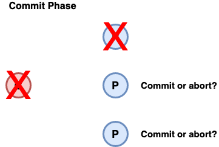
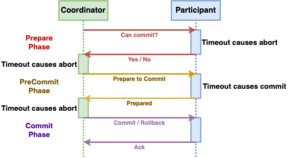

# Three-Phase Commit (3PC)

- [**Motivation**](#motivation)
- [**Solution**](#solution)
   - [Concepts](#concepts)
   - [Implementation](#implementation)
- [**Pros & Cons**](#pros--cons)
   - [Pros](#pros)
   - [Cons](#cons)
- [**Consideration**](#consideration)
- [**When To Use**](#when-to-use)
- [**References**](#references)

## Motivation
- 2PC cannot dependably recover from a failure of both the coordinator and a participant during the commit phase.
   - In the commit phase, the coordinator send "doCommit" to the first participant and the first participant does the commit. 
   
     
   - But after that, the coordinator and the first participant fail together. the rest of participant don't know the decision (commit or abort). 
   
     

## Solution
### Concepts

- Add a new phase (prepared to commit phase) in the middle of the original 2 phases in 2PC.
- Provide a dependable recovery solution from a participant failure or both coordinator and participant failure during commit phase.

### Implementation

## Pros & Cons
### Pros
- It is a non-blocking protocol.

### Cons
- Cannot guarantee atomicity.
- Long latency to complete each transaction (Needing a minimum of three round trip times).

## Consideration
| Topic | Consideration | Possible Solution Options |
|----|-----|-----|

## When To Use

## References
